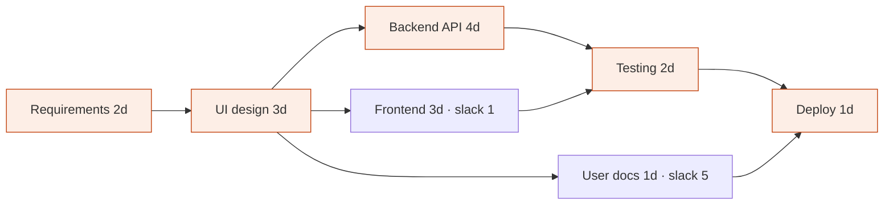

# FlowPlan

[](https://github.com/ahmed-malikk/FlowPlan/actions/workflows/test.yml)

A lightweight project scheduler that shows which tasks hold up the whole project.

Small teams miss deadlines because nobody can see which tasks block everything else. FlowPlan takes your tasks, their durations and their dependencies, then calculates the **critical path** and the **slack** for every task, so you know exactly what you can't let slip.

> Live demo: coming soon (Vercel).

## Features (MVP)

- **Projects**: create, open and delete projects, each with its own start date
- **Tasks**: name, duration in whole days, optional owner, and the tasks it waits for (multi-select); inline edit and delete
- **Loop detection**: a save that would create a circular dependency is blocked, and the message names the loop (`A → B → C → A`)
- **Critical path + slack**: critical tasks are red in the table and the timeline, and every other task shows how many days it can slip
- **Timeline**: Gantt chart with slack drawn as dashed boxes
- **Instant what-if**: use the −/+ buttons on any duration and the finish date updates immediately (the summary shows the change, e.g. `+2d`)
- **Summary panel**: finish date, total duration, critical task count and warnings
- **Auto-save** in the browser (localStorage), no sign-up needed. Print / save as PDF from the project page

## How it works

FlowPlan uses the Critical Path Method. All the logic is in [`src/lib/scheduler.ts`](src/lib/scheduler.ts), which contains no React code:

1. **Build the graph**: each task is a node, and each dependency is an arrow.
2. **Topological sort** (Kahn's algorithm): if some tasks can't be ordered, they form a loop.
3. **Forward pass**: earliest start = the latest earliest-finish among its dependencies.
4. **Backward pass**: latest finish = the earliest latest-start among the tasks waiting for it.

Slack = latest start − earliest start. The tasks with zero slack make up the critical path. The whole calculation is **O(V + E)**.



The worked example above takes 12 days, and its critical path is A → B → C → E → G. Open it in the app with **Open the example project**.

## Run locally

```bash
npm install
npm run dev        # http://localhost:3000
npm test           # Vitest unit tests: scheduler, validation, storage
npm run test:e2e   # Playwright system tests in Edge, Chrome and a 375px phone view
npm run typecheck
npm run build
```

The system tests use the Edge and Chrome already installed on the machine. To test on a real phone, run the production build on your network: `npm run build`, then `npx next start -H 0.0.0.0`, and open `http://<your-laptop-ip>:3000` on the phone (same Wi-Fi). `npm run dev` only serves its scripts to `localhost`, so it won't work on a phone.

## Testing

| Level | Tool | Cases | Latest result |
|---|---|---|---|
| Unit | Vitest | 44 | 44 / 44 pass |
| System (end-to-end) | Playwright | 14 cases × 3 environments | 42 / 42 pass |
| Usability | 3 first-time users | protocol in the test plan | not yet run |

Testing found two layout defects on phones ([#11](https://github.com/ahmed-malikk/FlowPlan/issues/11), [#13](https://github.com/ahmed-malikk/FlowPlan/issues/13)); both are fixed. See the [test plan](docs/test-plan.md) and [test report](docs/test-report.md).

## Project structure

```
src/app/page.tsx               projects list
src/app/project/[id]/page.tsx  tasks + timeline + summary
src/components/                TaskTable, TaskForm, DependencyPicker, Gantt, SummaryPanel
src/lib/scheduler.ts           graph, cycle check, CPM (the key file)
src/lib/plan.ts                validation, safe edits, day → date conversion
src/lib/storage.ts             save/load in localStorage
src/lib/*.test.ts              Vitest tests
```

## Tech stack

Next.js · TypeScript · Vitest · GitHub Actions · Vercel

## Docs

- [Product Requirements Document](docs/PRD.md)
- [Test plan](docs/test-plan.md)
- [Test report](docs/test-report.md)
