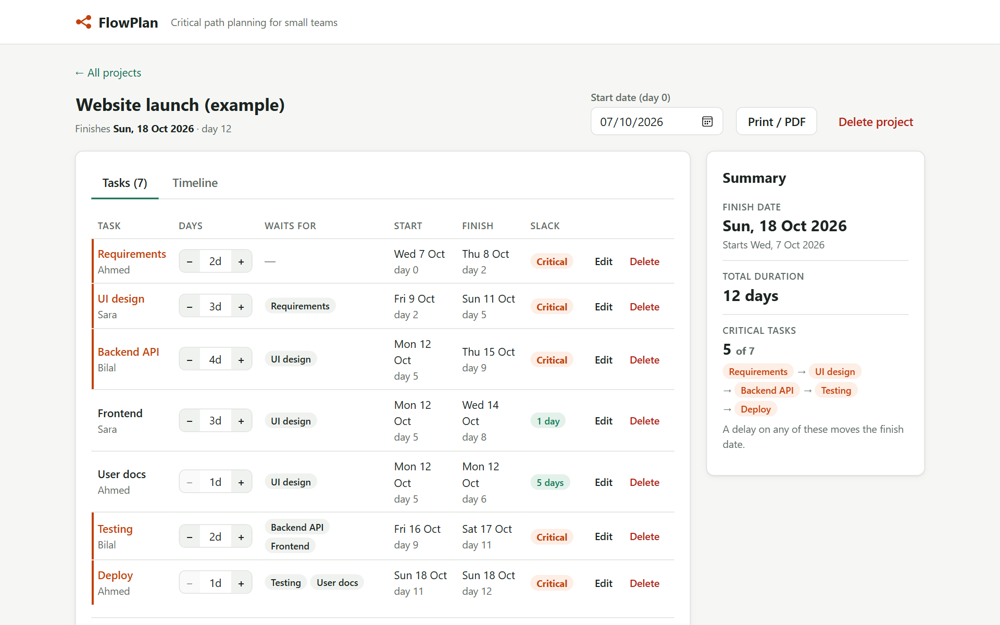
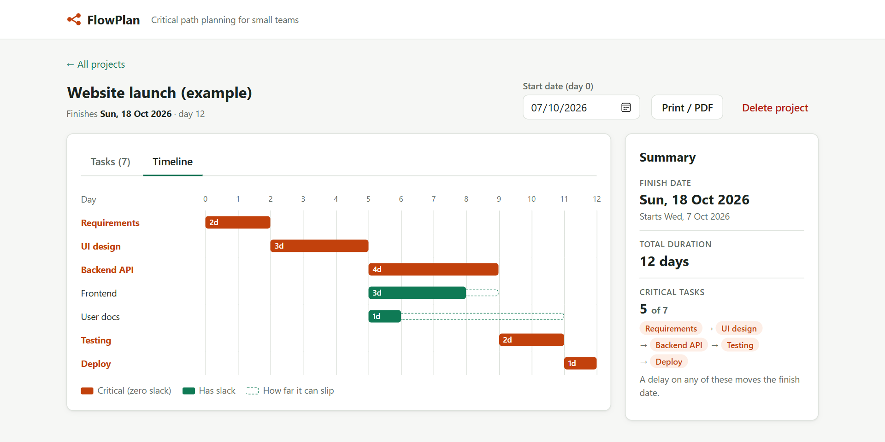
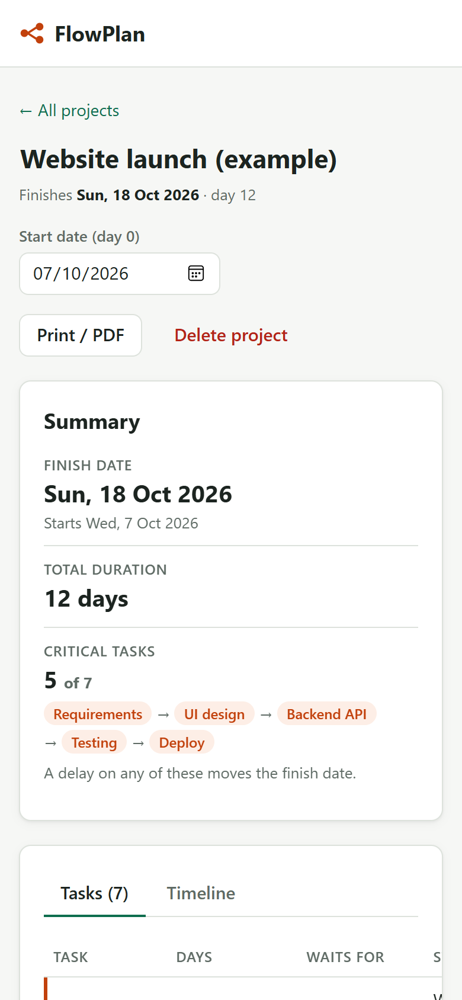
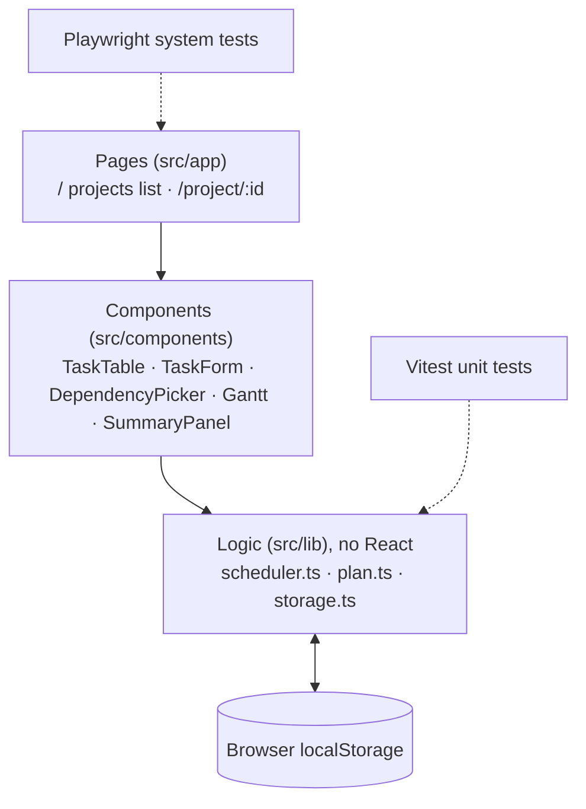
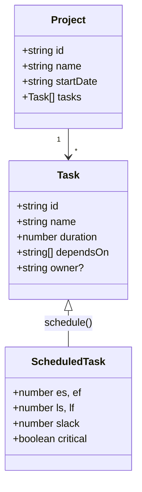
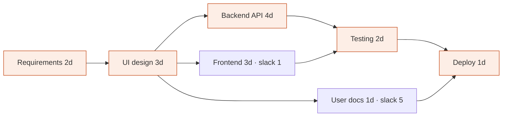

# FlowPlan

> Small teams miss deadlines because their tools list tasks but can't show which ones control the deadline. FlowPlan finds the critical path and shows how far every other task can slip.

[](https://github.com/ahmed-malikk/FlowPlan/actions/workflows/test.yml)

**Live:** [flow-plan-five.vercel.app](https://flow-plan-five.vercel.app/) · **PRD:** [docs/PRD.md](docs/PRD.md) · **Tests:** [plan](docs/test-plan.md) · [report](docs/test-report.md) · **Board:** [issues](https://github.com/ahmed-malikk/FlowPlan/issues?q=is%3Aissue)



**Try it in 30 seconds:** open the live link and click **Open the example project**. Then press **+** on *Backend API* (a critical task) and watch the finish date move, or press **+** on *Frontend* (1 day of slack) and watch it stay put. No sign-up needed.

## Why I built it

Trello lists, WhatsApp threads and spreadsheets can't answer the question that matters most to a deadline: *if this task is late, does the delivery date move?* Tools that can, like MS Project, are heavy and paid for a 3–10 person team. FlowPlan is the first project of my 3-week, 10-project portfolio, and its first real user is me: I'm using it to plan that portfolio sprint ([#10](https://github.com/ahmed-malikk/FlowPlan/issues/10)).

## Features

- **Tasks with dependencies:** name, duration in whole days, optional owner, and the tasks it waits for; inline edit and delete
- **Loop detection:** a change that would create a circular dependency is blocked, and the message names the loop (`A → B → C → A`)
- **Critical path + slack:** critical tasks are red in the table and timeline; every other task shows how many days it can slip
- **Timeline:** Gantt chart with slack drawn as dashed boxes
- **Saved in the browser:** no account; projects survive closing the tab

Plus an instant *what-if* (−/+ on any duration updates the finish date and shows the change, e.g. `+2d`), a summary panel, an example project, and print / save as PDF.

| Timeline | Phone (375 px) |
|---|---|
|  |  |

## Tech stack

Next.js 16 · React 19 · TypeScript (strict) · localStorage · Vitest · Playwright · GitHub Actions · Vercel

## Architecture

Three layers. The bottom layer is pure TypeScript with no React, so the scheduling logic can be tested and explained on its own.





## The core algorithm

FlowPlan uses the **Critical Path Method**. All of it is in [`src/lib/scheduler.ts`](src/lib/scheduler.ts):

1. **Build the graph:** each task is a node; "B waits for A" is an arrow A → B.
2. **Topological sort (Kahn's algorithm):** repeatedly take a task whose prerequisites are all placed. If some tasks can never be placed, they wait for each other: that's a loop, and FlowPlan walks back through them to name it.
3. **Forward pass:** earliest start = the latest earliest-finish among the tasks it waits for.
4. **Backward pass:** latest finish = the earliest latest-start among the tasks waiting for it.

**Slack = latest start − earliest start.** Tasks with zero slack are the critical path: delay any one of them and the project is late.

**Worked example** (the "Open the example project" button): 7 tasks, **12 days**, critical path **A → B → C → E → G**.



Testing can't start until Backend (day 9) and Frontend (day 8) are both done, so Frontend has 1 day of slack. If Backend slips 2 days, the project moves from day 12 to day 14.

**Complexity:** every step visits each task (V) and dependency (E) a constant number of times, so the whole calculation is **O(V + E)** time and space. That's fast enough to recalculate on every keystroke.

## Design decisions

| Decision | Why | Trade-off |
|---|---|---|
| Scheduling logic in pure functions with no React | Easy to unit test and to explain; survives a UI rewrite | A little more wiring between layers |
| Kahn's algorithm for ordering | Gives the order *and* the loop check in one iterative pass, no recursion limits | Naming the exact loop needs a small extra walk |
| Validate the *proposed* plan before saving | A change that would create a loop is never stored, so saved data is always a valid graph | Every save runs the sort (cheap at O(V + E)) |
| Recalculate on every change, no caching | O(V + E) is instant for hundreds of tasks; simpler code | Would need memoising for very large plans |
| localStorage, no backend | Zero cost and setup; data stays private; enough for single-user v1 | No sharing or sync between devices (planned for v2 with Supabase) |
| Days as integers, dates only for display (UTC) | No time-zone or daylight-saving bugs | Weekends and holidays aren't skipped yet (v1.2) |
| Dependencies stored by id, not name | Renaming a task never breaks links | Ids are meaningless when reading raw data |

## How I ran it as a project

- **PRD written before coding:** problem, target user, goals and non-goals, 6 user stories with acceptance criteria, success metrics, risks ([docs/PRD.md](docs/PRD.md))
- **13 GitHub issues:** 8 MVP stories and setup, 2 delivery tasks, 1 testing task, 2 bugs found by testing; each closed with a note or a `Closes #n` commit
- **Small commits** in the `feat:` / `fix:` / `test:` / `docs:` style; CI runs typecheck, tests and build on every push
- **Test plan and test report** with traceability from each story to its tests ([plan](docs/test-plan.md), [report](docs/test-report.md))
- **Honest plan vs actual:** features were committed in one batch at the end of the build instead of one by one, and the issue board was published after the build. Both are lessons carried into the next project.

## Results

- **Correctness:** the scheduler matches hand calculations for the worked example (every ES/EF/LS/LF/slack value), three further projects and nine edge cases: **44 / 44 unit tests**.
- **System tests:** 14 user journeys in desktop Edge, desktop Chrome and a 375 px phone view: **42 / 42 pass on the local production build and 42 / 42 on the live Vercel site** (2026-10-07).
- **Bugs found and fixed:** testing found 2 phone-only layout defects ([#11](https://github.com/ahmed-malikk/FlowPlan/issues/11), [#13](https://github.com/ahmed-malikk/FlowPlan/issues/13)); both are fixed and covered by tests.
- **Still to measure:** usability with 3 first-time users (target: a 6-task plan in under 5 minutes) and my own 3-week plan in FlowPlan. Results will be added here when they're real.

## What I'd do next

- **v1.1:** assign owners and warn when one person has overlapping tasks
- **v1.2:** working calendar that skips weekends and holidays
- **v2.0:** accounts and a shareable read-only link for clients (Supabase)
- **v2.1:** track actual vs planned progress and flag tasks that are eating their slack
- Run the Playwright tests in CI, and add Safari/Firefox

## Run locally

```bash
npm install
npm run dev        # http://localhost:3000
npm test           # Vitest unit tests: scheduler, validation, storage
npm run test:e2e   # Playwright system tests in Edge, Chrome and a 375px phone view
npm run typecheck
npm run build
```

- `npm run test:e2e` uses the Edge and Chrome already installed on the machine. To run the same tests against the live site: `E2E_BASE_URL=https://flow-plan-five.vercel.app npx playwright test`.
- **Testing on a real phone:** `npm run build`, then `npx next start -H 0.0.0.0`, then open `http://<your-laptop-ip>:3000` on the phone (same Wi-Fi). `npm run dev` only serves its scripts to `localhost`, so it won't work on a phone.

### Project structure

```
src/app/page.tsx               projects list
src/app/project/[id]/page.tsx  tasks + timeline + summary
src/components/                TaskTable, TaskForm, DependencyPicker, Gantt, SummaryPanel
src/lib/scheduler.ts           graph, cycle check, CPM (the key file)
src/lib/plan.ts                validation, safe edits, day → date conversion
src/lib/storage.ts             save/load in localStorage
src/lib/*.test.ts              Vitest unit tests
e2e/flowplan.spec.ts           Playwright system tests (ST-01 … ST-14)
docs/                          PRD, test plan, test report, screenshots
```
